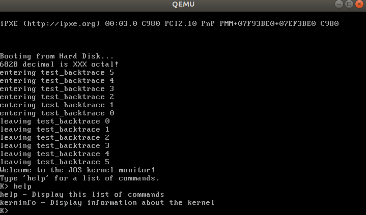
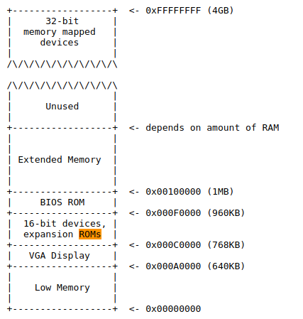

# Lab 1: Booting a PC

> 2020.7.29: 我又重新开始了！这次使用的是wsl(同样也是Ubuntu 18.04LTS)，希望不会遇到太多的坑

[链接](https://pdos.csail.mit.edu/6.828/2018/labs/lab1/)


本实验分为三个部分：
1. 熟悉x86, QEMU x86模拟器, PC开机引导流程
2. 研究 JOS 的 boot loader(引导加载程序), 位于实验文件夹的`boot`目录
3. 研究 JOS 的 template, 位于实验文件夹的`kernel`目录 

# Part 0: 实验环境搭建

> 工欲善其事，必先利其器

Lab所需环境由三部分组成 - JOS模板仓库，gcc编译器， qemu模拟器；gcc编译器是许多Linux Distribution自带的（我用的是Ubuntu 18.04 LTS），因此这里只介绍 JOS模板仓库 和 qemu 的安装过程

## JOS Git

```sh
git clone https://pdos.csail.mit.edu/6.828/2018/jos.git lab
```

## QEMU

[官网](https://www.qemu.org/)<br>QEMU是一个PC模拟器（可以在上面搭建虚拟机）；但QEMU的调试功能不足以进行实验，因此 6.828 为它加入了调试功能，下面是安装步骤：
1. `git clone https://github.com/mit-pdos/6.828-qemu.git qemu`
2. 在Linux环境下，可能得安装一些libraries:  libsdl1.2-dev, libtool-bin, libglib2.0-dev, libz-dev, and libpixman-1-dev. `sudo apt-get install xxx`
3. 然后进到仓库目录，进行一些配置<br>
Linux: `./configure --disable-kvm --disable-werror [--prefix=PFX] [--target-list="i386-softmmu x86_64-softmmu"]`<br>其中 `prefix`声明安装qemu的位置，如果不声明会安装在 `/usr/local`; `target-list` 缩减了qemu所支持的架构（为qemu瘦身）
1. 进行编译和安装 `make`, `make install`

# Part 1: PC Bootstrap

## x86学习

首先需要学习 x86 汇编 - [PC Assembly Language Book](https://pdos.csail.mit.edu/6.828/2018/readings/pcasm-book.pdf)<br>
**注意**：上面这本书里是 NASM assembler(Intel syntax)，而JOS用的是GNU assembler(AT&T syntax)；[这里](http://www.delorie.com/djgpp/doc/brennan/brennan_att_inline_djgpp.html)阐述了他们的区别，读一下这里面的 "The Syntax" 章节; 另外，详细的工具书保存到了主目录 [资料.md](../../资料.md)


## x86模拟器 - QEMU

> 感觉用wsl的话需要先装个图形界面

虽然实验用的是模拟器，但要**代码能在模拟器上跑，就能在真机上跑**；使用模拟器更好**调试**

6.828使用 [QEMU 模拟器](https://www.qemu.org/)，并配合 [GDB](http://www.gnu.org/software/gdb/) 进行Debug（QEMU内置调试功能不完善），下面的实验就马上用到GDB来研究开机流程

首先来编译前面git clone下来的jos（现在还只是模板）。输入`make`会编译产生最简版本的jos引导加载程序 以及 jos内核。如果出现错误`undefined reference to '__udivdi3'`, 是因为没有 32位的gcc multilib, `sudo apt-get install gcc-multilib`可破

> 回忆一下之前在鸟哥Linux学习的开机流程：BIOS启动后，从MBR（主引导记录，硬盘第一扇区）里抽取出引导加载程序(boot loader) 然后boot loader载入内核程序开始运行操作系统；boot loader 也可以放在其他存储设备的 boot section 内，由MBR转向它来实现多系统启动的功能

make生成的`kernel.img`就是一块虚拟硬盘，包含了boot loader和kernel(可以认为boot loader放在kernel.img的boot section内)

接下来就可以启动JOS了（\\(≧▽≦)/）; 实验里集成了make来运行：`make qemu`；实际上运行的是（假设刚才qemu安装在了/usr/local）：`/usr/local/bin/qemu-system-i386 obj/kern/kernel.img`. 

**注意**：
- 使用`make qemu`会导致VGA和命令行同时输出；同样的，`make qemu`也会同时接受VGA和命令行的输入；
- 使用 `make qemu-nox` 则不会有VGA输出，便于ssh连接。在没有图形界面的linux（比如我现在的wsl），就一定得nox。看了看`GNUmakefile`文件，其实就是加了个 `-nographic` 参数。
- 退出qemu使用 `ctrl+a x`。

然后jos就跑起来了(有时快乐就是这么简单)，注意点击屏幕会失去鼠标控制，`Ctrl+Alt`可以恢复。截图留念：


'Booting from Hard Disk...' 之后的内容就是 JOS内核 (前面可看作BIOS)；K> 是个提示符，由kernel的`monitor`模块产生。现在只有两个指令：`help` 和 `kerninfo`

## PC的物理地址空间

此处来研究一下PC启动和物理地址空间的关系。该图是32位处理器的



- 8088 处理器只能处理 1MB 物理地址，因此早期PC只能使用 Low Memory 部分作为 RAM；
- 早期PC将 BIOS 存放在 BIOS ROM 中，而现在是存放在 updatable flash memory 中；BIOS负责设备初始化并从存储设备中导入boot loader进行开机程序
- 80286-16MB; 80386-4GB; 但**仍保留低地址的架构以向下兼容**。因此现在PC的物理地址空间被分割为两部分：low memory (头640KB) 和 extended memory (>1MB部分) 
- 32-bit 机器在RAM之后（也即地址的最末端）还由BIOS分配了一些空间给 PCI设备（百度了一下类似于扩展内存槽的东西）
- x86 处理器现在又能支持高于4GB的物理地址空间，因此RAM会被分割为三块
- **JOS只使用PC物理地址空间的 头256MB**，因此实验只讨论32位地址空间

## 探究 ROM BIOS

在这一部分，我们将使用 QEMU 的调试设备探究 兼容 `IA-32` 的PC是如何启动的。

启动两个终端并cd到jos目录。在一个终端输入`make qemu-gdb`(或者`make qemu-nox-gdb`)，于是 QEMU 启动并开始等待GDB的连接；在另一个终端，输入`make gdb`

首先可以看到第一条输出:
```
[f000:fff0]    0xffff0:	ljmp   $0xf000,$0xe05b
```

- 实模式计算公式：16*CS(segment index) + IP(offset)
- 启动的第一个命令地址是 0x000f fff0，刚好是 0x0010 0000 - 16B，也即ROM的顶部segment
- 这个第一个命令执行了个jump，跳到ROM的更前的位置 0x000f e05b
- [ ]  interrupt descriptor table
- [ ]  PCI bus
- `si` 使用gdb单步执行
  - [博客](http://www.cnblogs.com/fatsheep9146/p/5078179.html)
  - [实模式和保护模式](https://blog.csdn.net/zdwzzu2006/article/details/4030948)
- 80386支持4G地址，实验JOS只用了256MB
- x86CPU采用IO端口单独编址的方式，独立于内存地址，out in 指令控制； 标准规定端口操作必须要用al寄存器作为缓冲
  - [IO设备清单](http://bochs.sourceforge.net/techspec/PORTS.LST)
- [ ] 80386所包含的寄存器
- [ ] 中断向量表（其实分了描述符表和向量表） [wiki](http://wiki.osdev.org/Interrupt_Descriptor_Table)
- 概括：PC上电，执行各种控制、检测工作(BIOS)，寻找存在os的磁盘，并从该磁盘的第一个扇区加载boot loader，然后再把控制权移交给os内核

# Part2：The Boot Loader 引导加载程序

硬盘最小单位是 512B 的 sector(扇区); 启动时将可启动硬盘的第一扇区读到 0x7c00-0x7dff，再jmp到这个这个地址(即CS:IP = 0000:7c00)

JOS的boot loader包含两个文件：boot/boot.S, boot/main.c, (怎么被合起来编译的)。干了这么两件事：
1. 实模式-->保护模式，保护模式下程序才能访问到高于1MB的物理地址空间；保护模式下上面那个CS:IP的实模式地址计算公式改变了，offset从16位变成了32位。（具体要看汇编书来好好学习）
2. 从硬盘中读取kernel，这是通过 x86独有IO指令 + IDE disk device registers配合完成，IO指令去跟寄存器交互读得数据


- obj/boot/boot.asm. This file is a disassembly of the boot loader that our GNUmakefile creates after compiling the boot loader. 比较适合用来debug，因为可以看到保护模式下实际操作的物理地址
- [ ] gdb操作学习 https://pdos.csail.mit.edu/6.828/2018/labguide.html
- [ ] 为什么使能 A20线 表示能进入保护模式？上面的链接里有讲，需要仔细看看
- [ ] 全局映射描述符寄存器 GDTR，也在上面可以找到